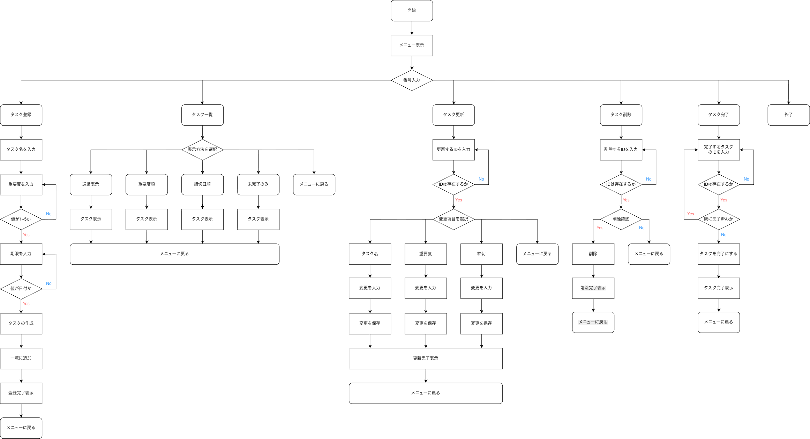

# SakiYaru

重要度と期限をもとに、取り組むべきタスクを分かりやすくするCLIタスク管理アプリです。

## 概要

SakiYaruは、タスクの登録・更新・削除・完了などの基本的な管理に加え、
重要度や期限を設定して優先順位を一覧で確認できるタスク管理アプリです。

複数のタスクがあるときに「何から取り組むべきか迷う」という課題を減らし、
限られた時間を有効に使えるようにすることを目的として作成しました。

## 主な機能

- タスクの登録
- タスクの一覧表示
- タスクの更新
- タスクの削除
- タスクの完了
- 重要度・締切日順での並び替え
- 未完了タスクの絞り込み

## フローチャート

## 使用技術・開発環境

- Java 21
- Eclipse
- Git / GitHub

## クラス構成

| クラス | 役割 |
| --- | --- |
| Main | アプリの起動 |
| Menu | メニューの表示・選択 |
| InputUtil | 入力受付・入力チェック |
| Task | タスクデータの保持 |
| TaskView | タスクの表示 |
| TaskService | タスクに関する処理 |
